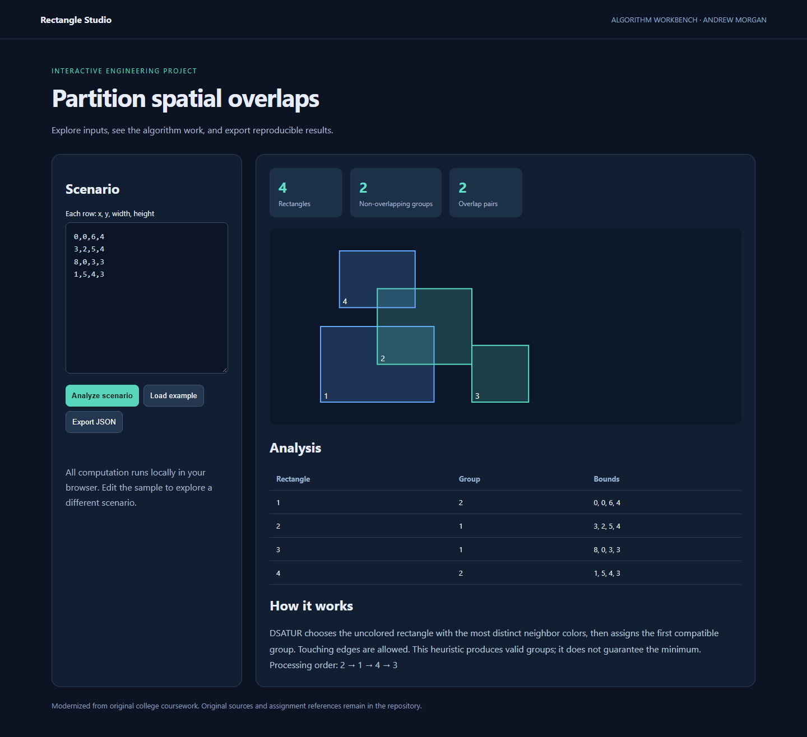

# Rectangles

Rectangle Studio partitions positive-area rectangle overlaps into valid non-overlapping groups using DSATUR graph coloring. Touching edges are permitted. DSATUR is a heuristic, not a guaranteed minimum-color solver.

## Run the modern interface

Open **web/index.html** in a current browser. No installation, server, account, or build step is required. All calculations stay in your browser.

- Editable scenarios, sample reset, input validation, and JSON result export.
- Responsive layout with keyboard-accessible controls and textual analysis alongside visual results.
- JSON exports include the input, selected options, and computed results.



## Verify

With Node.js 22 or newer, run:

```sh
npm test
```

The dependency-free shared algorithm module is in web/engine.js. Tests cover overlap boundaries, deterministic scheduling, preemption, idle intervals, unsafe states, invalid matrices, geometry measurement, and boundary detection. GitHub Actions runs the checks on pushes and pull requests.

## Original coursework

The original C++ sources and supplied assignment references are retained for provenance. The browser interface uses a separately tested JavaScript implementation. Legacy sources are historical and are not the recommended entry point; they have not been newly validated. No production scale or performance claim is implied.

## Portfolio capture

See [docs/portfolio.md](docs/portfolio.md) for a reproducible demo and placement guidance.
